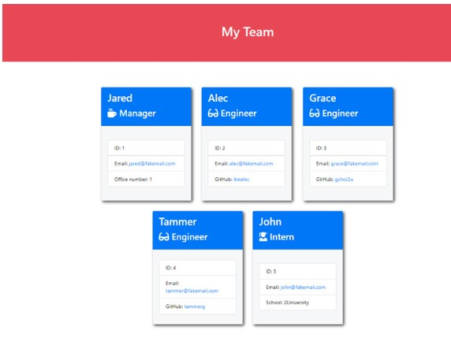

# Team-Profile-Generator

* This is a Node.js command-line application that takes in information about employees on a software engineering team and generates an HTML webpage that displays summaries for each person. Because testing is key to making code maintainable, unit tests for each part of the code has been validated. 

* Application demo link: 

* Mockup 

